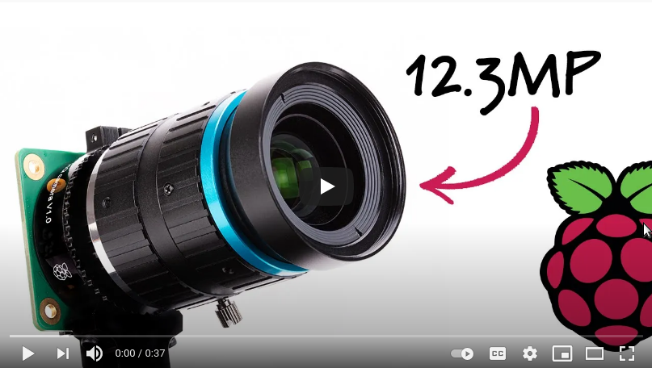
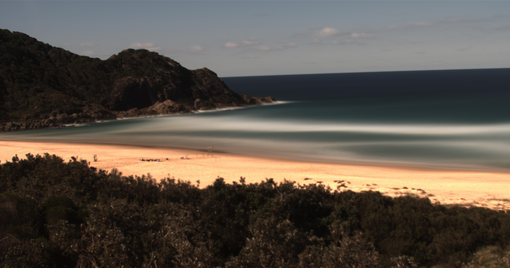
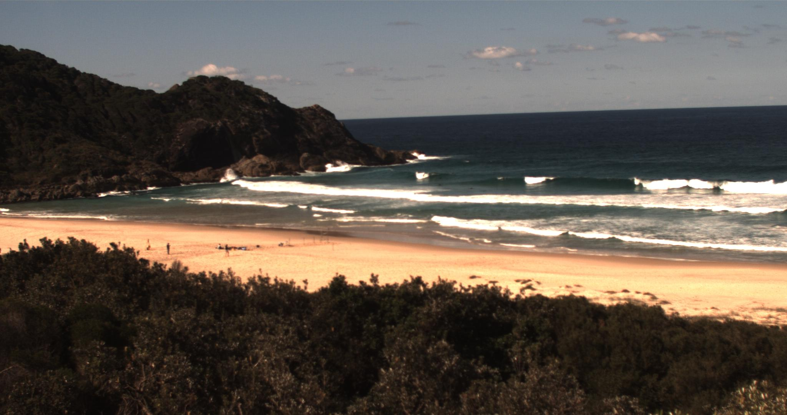
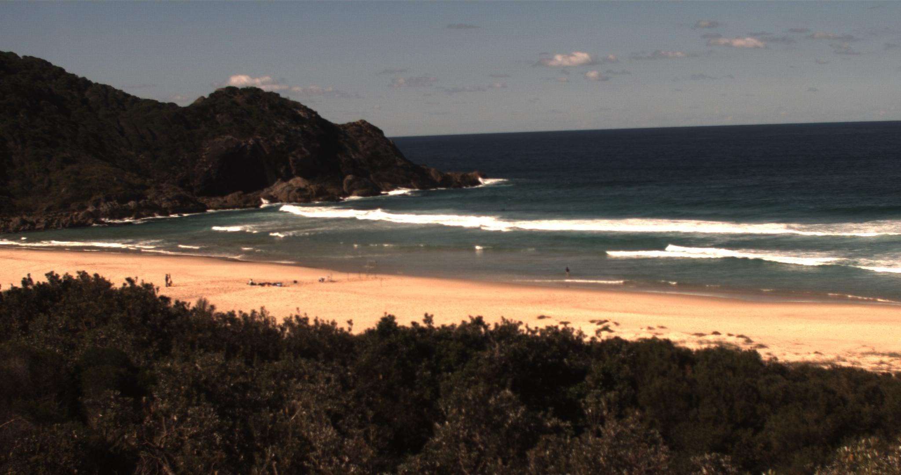
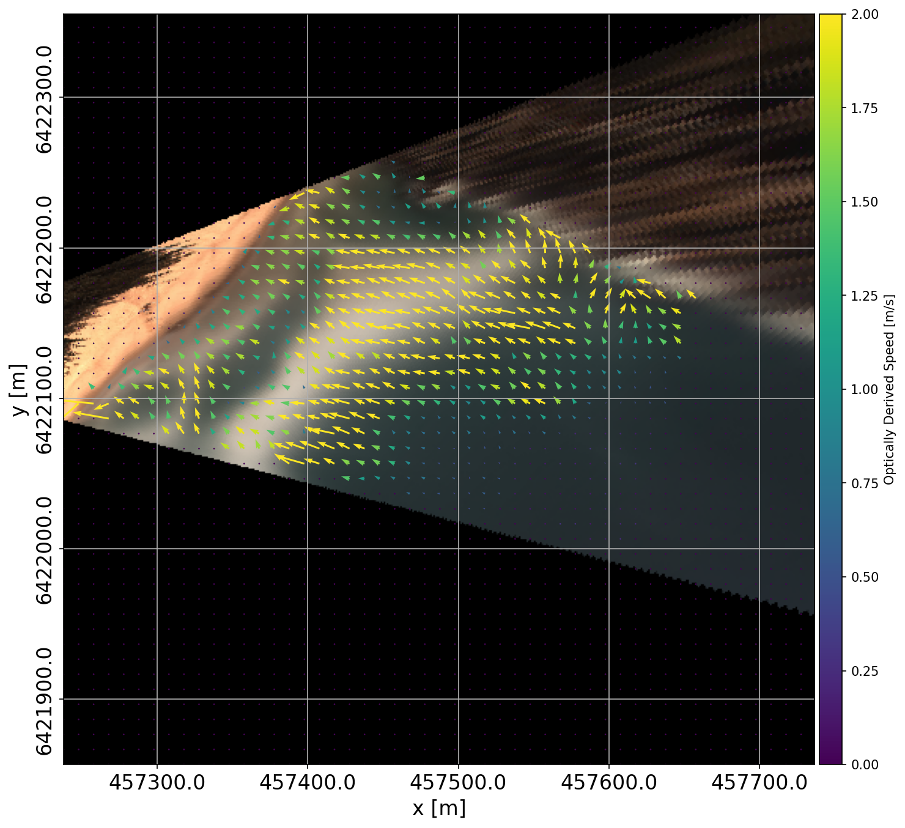
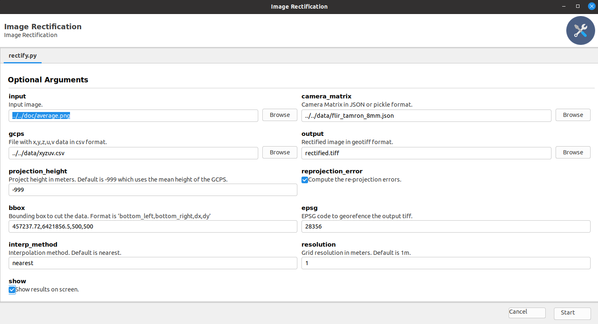
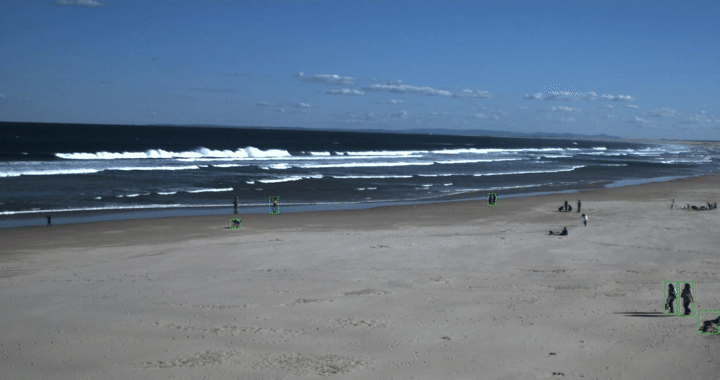

# Introduction

This project aims to provide the information needed to build an ARGUS-like
coastal monitoring system based on the Raspberry Pi computer board. Both the Raspberry Pi High Quality Camera and FLIR machine vision cameras are supported.

This a continuation and update to the system deployed at the Figure 8 pools
site, which was detailed in [this paper](https://www.mdpi.com/2072-4292/10/1/11)
and was operational for over an year.

The image below was captured at Boomerang Beach (New South Wales) in early 2019
year with a very similar similar set-up to the one described in this repository.


# Table of Contents

- [1. Hardware](#1-hardware)
  * [1.1. Computer Board](#11-computer-board)
  * [1.2. FLIR Machine Vision Camera](#12-flir-machine-vision-camera)
  * [1.3 Raspberry Pi High Quality Camera (2021 update)](#13-raspberry-pi-high-quality-camera--2021-update-)
- [2. Software](#2-software)
  * [2.1. Operating System (OS)](#21-operating-system--os-)
    + [2.1.1. Ubuntu Mate Installation](#211-ubuntu-mate-installation)
  * [2.2. FLIR's SDK](#22-flir-s-sdk)
    + [2.2.1. Dependencies](#221-dependencies)
    + [2.2.2. Spinnaker Install](#222-spinnaker-install)
    + [2.2.3. PySpin](#223-pyspin)
  * [2.3 Raspberry Pi HQ Camera](#23-raspberry-pi-hq-camera)
- [3. Image Capture Configuration File](#3-image-capture-configuration-file)
  * [3.1 FLIR Camera](#31-flir-camera)
  * [3.2 Raspberry Pi HQ Camera](#32-raspberry-pi-hq-camera)
    + [Options](#options)
  * [3.3. Email Notifications (Optional)](#33-email-notifications--optinal-)
- [4. Capturing Frames](#4-capturing-frames)
  * [4.1. Displaying the Camera Stream](#41-displaying-the-camera-stream)
    + [FLIR Camera](#flir-camera)
    + [Raspberry Pi HQ Camera](#raspberry-pi-hq-camera)
    + [Desktop icon (Optinal)](#desktop-icon--optional-)
  * [4.2. Single Capture Cycle](#42-single-capture-cycle)
  * [4.3. Scheduling Capture Cycles](#43-scheduling-capture-cycles)
  * [4.4. Controlling the Cameras Remotely](#44-controlling-the-cameras-remotely)
- [5. Camera Calibration](#5-camera-calibration)
  * [5.1. Generating a ChArUco Board](#51-generating-a-charuco-board)
  * [5.2. Offline Calibration](#52-offline-calibration)
  * [5.3. Online Calibration](#53-online-calibration)
- [6. Post Processing](#6-post-processing)
  * [6.1. Average and Variance Images](#61-average-and-variance-images)
  * [6.2. Brightest and darkest images](#62-brightest-and-darkest-images)
  * [6.3. Rectification](#63-rectification)
  * [6.4. Timestacks](#64-timestacks)
  * [6.5 Optical Flow](#65-optical-flow)
  * [6.6 Graphical User Interfaces (GUIs)](#66-graphical-user-interfaces--guis-)
- [7. Machine Learning](#7-machine-learning)
  * [7.1 People Detector](#71-people-detector)
  * [7.2 Active Wave Breaking Segmentation](#72-active-wave-breaking-segmentation)
- [8. Known issues](#8-known-issues)
  * [7.1. FLIR Camera start up](#71-flir-camera-start-up)
  * [7.2. `libmmal.so` issue on Ubuntu Mate 20.04](#72--libmmalso--issue-on-ubuntu-mate-2004)
  * [7.3 - Upside-down display](#73---upside-down-display)
- [8. Future improvements](#8-future-improvements)
- [9. Disclaimer](#9-disclaimer)


This tutorial assumes that you have some familiarity with the Linux command line
and at least some basic understanding of python programming.

# 1. Hardware

## 1.1. Computer Board

This project has been developed using a Raspberry Pi Model 4 B with 4Gb of memory. Better results may be achieved using the new Raspberry Pi 4 with 8Gb.

The components of the system are:
1. [Raspberry Pi board](https://www.raspberrypi.org/products/raspberry-pi-4-model-b/)
2. [Raspberry Pi 7in display](https://www.raspberrypi.org/products/raspberry-pi-touch-display/)
3. [Raspberry Pi display case](https://www.canakit.com/raspberry-pi-4-lcd-display-case-pi4.html)
4. [16Gb+ SD card](https://www.raspberrypi.org/documentation/installation/sd-cards.md)
5. Keyboard
6. Mouse
7. External storage. In this case a 32Gb USB stick.
8. [Optional] 4G modem for email notifications.
9. [Optional] Battery bank
10. [Optional] Solar panel


Assembly should be straight forward but if in doubt, follow the tutorials from
the Raspberry Pi Foundation:

[](https://www.raspberrypi.org/help/quick-start-guide/2/)

## 1.2. FLIR Machine Vision Camera

Our camera of choice is the [Flea 3 USB3 3.2 MP](https://www.flir.com/products/flea3-usb3/) model. The implementation provided here should also work with
any FLIR machine vision USB3 camera.

For this project, we used a [Tamron 8mm lens](https://www.flir.fr/products/tamron-8mm-11.8inch-c-mount-lens/). Note that you will need a C to CS mount adaptor if your camera has a CS mount and your lens has a C mount.

After assembly, you should have something similar to the system below.

[]()


## 1.3 Raspberry Pi High Quality Camera (2021 update)

In 2020, the Raspberry Pi foundation released the [High Quality Camera](https://www.raspberrypi.org/products/raspberry-pi-high-quality-camera/) for the Pi. This camera allows to use any type of lens which is perfect for our project. This camera costs around 75 USD and is much easier to use and program than the FLIR cameras. Everything is also open-source. Because the hardware only costs a fraction of the FLIR's camera, do not expect the same quality.

[](https://www.youtube.com/watch?v=YzEZvTwO7tA)


# 2. Software

## 2.1. Operating System (OS)

FLIR recommends Ubuntu for working with their cameras. Unfortunately,
the full version of Ubuntu is too demanding to run on the Raspberry Pi 4.
Therefore, we recommend [Ubuntu Mate](https://ubuntu-mate.org/) 20.04.

If you are interest in using only Raspberry Pi's HQ camera, [Raspberry Pi OS](https://www.raspberrypi.org/software/) is a much lighter option and usually comes pre-installed with the board. Note that FLIR's cameras won't play well with Raspberry Pi OS (at least in our experience).

### 2.1.1. Ubuntu Mate Installation

On a separate computer,

1. Download the appropriate Ubuntu Mate image from [here](https://ubuntu-mate.org/raspberry-pi).
2. Use [Fletcher](https://www.balena.io/etcher/) to flash the image to the SD card.

Insert the SD card in the Raspberry Pi and connect to mains power.

If everything worked, you will be greeted by Ubuntu Mate's installer. Simply
follow the installer's instructions and finish the install. If everything goes
correctly, the system will reboot and you will be greeted by the welcome screen.

For this tutorial, we only created one user named *pi*.


## 2.2. FLIR's SDK

### 2.2.1. Dependencies

Before installing FLIR's software, there are several package dependencies that
need to be installed.

First update your Ubuntu install:

```bash
sudo apt update
sudo apt dist-upgrade
```
This will take a while to finish. Go grab a coffee or a tea.

Next, install the build-essentials package:

```bash
sudo apt install build-essential
```

Now install the required dependencies:

```bash
sudo apt install libusb-1.0-0 libpcre3-dev
```
Finally, install GIT in order to be able to clone this repository.

```bash
sudo apt install git
```

### 2.2.2. Spinnaker Install

[Spinnaker](https://www.flir.com/products/spinnaker-sdk/) is the software responsible for interfacing the camera and the computer.
Download Spinnaker from [here](https://flir.app.boxcn.net/v/SpinnakerSDK). Make sure to download the correct version (Ubuntu 20.04, armhf)

Open the folder where you downloaded Spinnaker and decompress the file.

Now, open a terminal in the location of the extracted files and do:
```bash
sudo sh install_spinnaker_arm.sh
```

Follow the instructions in the prompt until the installation is complete.

**Note:** You may fall into a dependency loop here. Pay close attention to
the outputs in the prompt after running the installer. If in trouble, `apt`
can help you:

```bash
sudo apt install -f --fix-missing
```

From FLIR's README file, it is also recommend to increase the size of USB stream
from 2Mb to 1000Mb. To do this, do not follow their instructions as they will
not work for Raspberry Pi Based systems. Instead do:

```bash
sudo nano /boot/firmware/cmdline.txt
```

Add to the end of the file:

```
usbcore.usbfs_memory_mb=1000
```


Set the `FLIR_GENTL32_CTI` environment variable:
```
cd ~
nano .bashrc
```

Add to the end of the file:

```
export FLIR_GENTL32_CTI=/opt/spinnaker/lib/flir-gentl/FLIR_GenTL.cti
```

Reboot your Raspberry Pi and check if it worked with:

```
cat /sys/module/usbcore/parameters/usbfs_memory_mb
```
Should display `1000`.

```
echo $FLIR_GENTL32_CTI
```
Should display `/opt/spinnaker/lib/flir-gentl/FLIR_GenTL.cti`.

Connect your camera, open a new terminal and launch Spinnaker GUI:

```bash
spinview
```

I everything went well, you should see your camera in the USB Interface panel
on the left.


We will not use Spinview too much in this project but it is a useful tool to debug your camera. Please check Spinnaker documentation regarding Spinview usage.

### 2.2.3. PySpin

It is recommend to use python 3.8 with PySpin. Fortunately, it comes pre-installed with Ubuntu Mate.

Before installing FLIR's python interface, make sure the following dependencies are met:

```bash
sudo apt install python3-pip
```

```bash
sudo python3 -m pip install --upgrade pip numpy matplotlib Pillow==7.0.0 natsort
```

Install [OpenCV](https://pypi.org/project/opencv-python/).

```bash
sudo apt install python3-opencv
```

Finally, download FLIR's python wheel from [here](https://flir.app.boxcn.net/v/SpinnakerSDK/) and install it.

```bash
sudo python3.8 -m pip install spinnaker_python-2.3.0.77-cp38-cp38-linux_armv7l.whl
```

## 2.3 Raspberry Pi HQ Camera

You probably already have everything you need if you installed FLIR's dependencies. If not, just make sure to install everything you need:

```bash
sudo python3 -m pip install numpy matplotlib natsort "picamera[array]"
```

OpenCV:

```bash
sudo apt install python3-opencv
```

With this camera, we can actually encode video, so make sure to have the latest versions of `h.264` and `ffmpeg`.

```
sudo apt install x264 ffmpeg
```

Much easier!

# 3. Image Capture Configuration File

## 3.1 FLIR Camera

The configuration file to drive a capture cycle is in JSON format:

It's very hard to program FLIR's cameras, so I will only provide basic options here. You will need to manually add code to `capture.py` in order to expand the options.

```json
{
    "data": {
        "output": "test/",
        "format": "jpeg",
        "hours": [5, 6, 7, 8, 9, 10, 11, 12, 13, 14, 15, 16, 17, 18]
    },
    "capture": {
        "duration": 20,
        "framerate": 2,
        "resolution": [1920, 1080],
        "offset": [80, 236]
    },
    "stream": {
        "framerate": 30,
        "resolution": [640, 480]
    },
    "post_processing": {
        "notify": true,
        "average": false,
        "deviation": false
    }
}
```

This file can be saved anywhere in the system and will be read any time a
camera operation takes place.

## 3.2 Raspberry Pi HQ Camera

This camera provides a lot more options, such as ISO and a handy `beach` exposure mode.

```json
{
    "data": {
        "output": "test/",
        "hours": [5, 6, 7, 8, 9, 10, 11, 12, 13, 14, 15, 16, 17, 18]
    },
    "capture": {
        "duration": 20,
        "framerate": 10,
        "resolution": [1920, 1080]
    },
    "stream": {
        "framerate": 30,
        "resolution": [640, 480]
    },
    "exposure": {
        "mode": "beach",
        "set_iso": false,
        "iso": 300
    },
    "h264": {
        "quality": 25,
        "sei": true,
        "sps_timing": true

    },
    "post_processing": {
        "extract_frames": true,
        "notify": true,
        "average": true,
        "deviation": true
    }
}
```

### Options

Explanation of the configuration parameters above:

Streaming and Capturing:

- ```output```: The location to where to write the frames. Sub-folders will be created based on the hour of the capture cycle.
- ```framerate```: The capture frequency rate in frames per second.
- ```duration```: Capture cycle duration in seconds.
- ```resolution```: Image size for capturing or streaming.
- ```offset_x```: Offset in the x-direction from the sensor start [FLIR only].
- ```offset_y```: Offset in the y-direction from the sensor start [FLIR only].
- ```capture_hours```: Capture hours. If outside these hours, the camera does not grab any frames.
- ```image_format```: Which format to write the frames.

Exposure and ISO:

- ```exposure```: Exposure mode for the HQ camera. Defaults to `beach`.
- ```set_iso```: Set ISO mode for the HQ camera. Defaults to `false`.
- ```iso```: Set a manual ISO value for the HQ camera.

`H.264` options:
- ```quality```: Set stream quality level. Defaults to 25 (high).
- ```sei```: Enhanced information for `h.264` encoding.
- ```sps_timing```:  Frame timings for `h.264` encoding.

Post-processing:

- ```notify```: will send an e-mail (see below).
- ```average```: will create an average image.
- ```deviation```: will create the deviation image.


## 3.3. Email Notifications (Optional)

**Warning**: This will require that you store a ```gmail``` user name and password in
plain text in your system. I strongly recommend to use an accounted that you
create exclusively for using the cameras.

After creating the account, create a hidden file named ".gmail" in your home
folder with the login and password.

```
cd ~
nano .gmail
```

Add the following contents:

```json
{
    "credentials": {
        "login": "some.login@gmail.com",
		"destination": "some.email@gmail.com",
        "password": "somepassword"
    },
    "options": {
        "send_log": true,
        "send_last_frame": true,
        "send_average": false,
        "send_deviation:": false
    }
}
```

To save and exit use ```ctrl+o``` + ```ctrl+x```.

Make sure to change gmail's security settings to allow you to send emails using python.

# 4. Capturing Frames

First, make sure you have the appropriate code. Clone this repository with:

```bash
cd ~
git clone https://github.com/caiostringari/PiCoastal.git picoastal
```

## 4.1. Displaying the Camera Stream

This is useful to point the camera in the right direction, to set the focus, and
aperture.

To launch the stream do:

### FLIR Camera
```bash
cd ~/picoastal
python3 src/flir/stream.py -i config_flir.json > stream.log &
```

### Raspberry Pi HQ Camera
```bash
cd ~/picoastal
python3 src/rpi/stream.py -i config_rpi.json > stream.log &
```
### Desktop icon (Optional)

It is also useful to create a desktop shortcut to this script so that you don't need to
use the terminal every time.

```bash
cd ~/Desktop
nano stream_flir.desktop
```

```
[Desktop Entry]
Version=1.0
Type=Application
Terminal=true
Exec=python3 /home/pi/picoastal/src/flir/stream.py -i /home/pi/picoastal/src/flir/config_flir.json
Name=PiCoastal Stream
Comment=PiCoastal Stream
Icon=/home/pi/picoastal/doc/camera.png
```

To save and exit use ```ctrl+o``` + ```ctrl+x```.

To use the **`HQ Camera`**, just change `flir` to `rpi` in the commands above.

## 4.2. Single Capture Cycle

The main capture program is [capture.py](src/capture.py). To run a single capture cycle, do:

```bash
cd ~/picoastal/
python3 src/flir/capture.py -i capture.json > capture.log &
```

Similarly, it's useful to create a Desktop shortcut. For example:

```
[Desktop Entry]
Version=1.0
Type=Application
Terminal=true
Exec=python3 /home/pi/picoastal/src/flir/capture.py -i /home/pi/picoastal/src/flir/config_flir.json
Name=PiCoastal Capture
Comment=PiCoastal Capture
Icon=/home/pi/picoastal/doc/camera.png
```

## 4.3. Scheduling Capture Cycles

The recommend way to schedule jobs is using ```cron```.

First we need to create a ```bash``` script that will call all the commands we
need need within a single capture cycle. One [example](src/flir/cycle_flir.json) would be:

```bash
#/bin/bash
# This is the main capture script controler

# create log dir
mkdir -p "/home/pi/logs/"

# export this variable
export FLIR_GENTL32_CTI=/opt/spinnaker/lib/flir-gentl/FLIR_GenTL.cti

# defines where your code is located
workdir="/home/pi/picoastal/src/"
echo "Current work dir is : "$workdir

# get the current date
date=$(date)
datestr=$(date +'%Y%m%d_%H%M')
echo "Current date is : "$date

# your configuration file
cfg="/home/pi/picoastal/src/flir/config_flir.json"
echo "Capture config file is : "$cfg

# your email configuration
email="/home/pi/.gmail"
echo "Email config file is : "$email

# change to current work directory
cd $workdir

# current cycle log file
log="/home/pi/logs/picoastal_"$datestr".log"
echo "Log file is : "$log

# call the capture script
script=capture.py
echo "Calling script : "$script
python3 $workdir/flir/$script -cfg $cfg > $log 2>&1
echo $(<$log)

# call the notification
script=notify.py
attachment=$(tail -n 1 $log)
echo $attachment
echo "Calling script : "$script
python3 $workdir$script -cfg $email -log $log -a $attachment
```

To add a new job to cron, do:

```bash
crontab -e
```

If this is your first time using ```crontab```, you will be asked to chose a
text editor. I recommend using ```nano```. Add this line to the end of the file:

```
0 * * * * bash /home/pi/picoastal/src/flir/cycle_flir.sh
```

To save and exit use ```ctrl+o``` + ```ctrl+x```.

## 4.4. Controlling the Cameras Remotely

Controlling the cameras remotely is quite easy. All you need to do is to make sure you have [RealVNC](https://www.realvnc.com/en/) installed both in the Raspberry Pi and in your phone. By default, Raspberry Pi Os has VNC installed, on Ubuntu you will need to install it by yourself. Tip: Create a hot spot using a second phone and connect both your main phone and the raspberry to the network to control it in the field.

# 5. Camera Calibration

Properly calibrating a camera is hard! To try to make it easier, the [`ChArUco`](https://docs.opencv.org/3.4/df/d4a/tutorial_charuco_detection.html) calibration model is recommended here. This method is advantageous over the traditional chessboard method because each marker on the calibration board can be tracked individually.

## 5.1. Generating a ChArUco Board

Each `ChArUco` board is unique. To create one with the default configuration, do:

```bash
python src/calibration/create_ChArUco_board.py
```

The result is is as follows:

<div align="center">

</div>


There are several parameters that can be set. Use `create_ChArUco_board.py --help` for details. Make sure to take note of which parameters were used to create the board because you will need to know then later!

## 5.2. Offline Calibration

To calibrate the camera from a series of images, do:

```bash
python src/calibration/calib_ChArUco_offline.py - i "input_images/" -o "camera_parameters.pkl|json"
```

Again, there are several parameters that can be set. Use `calib_ChArUco_offline.py --help` for details.

## 5.3. Online Calibration

To calibrate the FLIR camera on-the-fly, do:

```bash
python src/calibration/ChArUco_online_calibration_flir.py - i "config.json" -o "camera_parameters.pkl|json"
````

To calibrate the Raspberry Pi camera on-the-fly, do:

```bash
python src/calibration/ChArUco_online_calibration_rpi.py - i "config.json" -o "camera_parameters.pkl|json"
````

As usual, there are several parameters that can be set. Use `ChArUco_online_calibration_flir|rpi.py --help` for details. The most import thing for camera calibration is to use the same board parameters as used for `create_ChArUco_board.py`

To investigate the results of a camera calibration do:

```
python src/calibration/show_calib_results.py -i "calibration.pkl" -o "result.png"
```

# 6. Post Processing

Post processing is usually too computationally expensive to run on the Raspberry Pi. However, some tools will be available here.

## 6.1. Average and Variance Images

To compute an average ([or time exposure](http://www.coastalwiki.org/wiki/Argus_image_types_and_conventions)) image you need to install some extra packages:

```bash
sudo apt install python3-scipy
sudo python3 -m pip install scikit-image tqdm
```

To compute the average, we use  the [`average.py`](src/post/average.py) script. Using the sample data provided in `data/boomerang/`:

```bash
cd ~/picoastal/
python3 src/post/average.py -i "data/boomerang" -o "average.png"
```

To compute an variance image you need to install another extra packages:

```bash
sudo python3 -m pip install welford
```

This package allows us to use [Welford's](https://en.wikipedia.org/wiki/Algorithms_for_calculating_variance) method and save memory. To compute the variance, we use  the [`variance.py`](src/post/variance.py) script. Using the sample data provided in `data/boomerang/`:

```bash
cd ~/picoastal/
python3 src/post/variance.py -i "data/boomerang" -o "variance.png"
```
The results should look like this:

|       Average        |       Variance        |
| :------------------: | :-------------------: |
|  |  |


## 6.2. Brightest and darkest images

To find the brightest and darkest images, use the [`variance.py`](src/post/brightest_and_darkest.py) script:

```bash
cd ~/picoastal/
python3 src/post/brightest_and_darkest.py -i "data/boomerang" -b "brightest.png" -d "darkest.png"
```
The result should look like this:

|       Brightest        |       Darkest        |
| :--------------------: | :------------------: |
|  |  |

This scripts converts the images to the `HSV` colour space and looks for the images with summed highest and lowest brightness (i.e., the `V` in the `HSV`).

## 6.3. Rectification

**Warning:** I do not recommend running this program on the Raspberry pi. It's possible to do so, but everything will take forever and, unless you have a pi with 4Gb+ of RAM, you will run into memory issues very quickly.

First, we will need `GDAL` to support exporting files to `geotiff`. On Ubuntu do:

```bash
sudo add-apt-repository ppa:ubuntugis/ppa
sudo apt update
sudo apt install gdal-bin libgdal-dev python3-gdal
```

Example:

```bash
cd ~/picoastal/
python3 src/post/rectify.py -i "input.png" -o "rectified.tiff" -gcps "xyzuv.csv" --camera_matrix "camera_matrix.json" --epsg "12345" --bbox "xmin,ymin,dx,dy"
```

Applying this code to the four statistical images calculated above, we get:

|          Average          |          Variance          |
| :-----------------------: | :------------------------: |
|  |  |

|          Brightest          |          Darkest          |
| :-------------------------: | :-----------------------: |
|  |  |

To see all command line the options, do `python3 rectify.py --help`.

## 6.4. Timestacks

To extract  a timestack, do:

```bash
cd ~/picoastal/
python3 src/post/timestack.py -i "path/to/images" -o "timestack.pkl" -gcps "xyzuv.csv" --camera_matrix "camera_matrix.json" --stackline "457315.2,6422161.5,457599.4,6422063.6"
```

To see all command line the options, do `python3 timestack.py --help`.

The resulting stack (using `plot_timestack.py`) looks something like this:


It may not the he most beautiful timestack ever but our code can now provide all the main functionalities as the most powerful commercial options available.

## 6.5 Optical Flow

A experimental script to compute surf zone currents based on [Farneback optical flow](https://docs.opencv.org/3.4/d4/dee/tutorial_optical_flow.html) is also available. This script will loop over all images and compute the `u` and `v` velocity components of the flow. The code will first rectify the images and then calculate the flow in the planar view so that the vectors are correctly oriented. This script is extremely slow and uses a lot of memory, hence not recommended to run on the Raspberry Pi. The output is a netCDF file, so you will need to install `xarray` with `pip install xarray netcdf4`. A mask in `geojson` format is required to mask regions of the image where it does not make sense to compute the flow.

Example:

```bash
cd ~/picoastal/
python3 src/post/optical_flow.py -i "path/to/images" -o "flow.nc" -gcps "xyzuv.csv" --camera_matrix "camera_matrix.json" --bbox "xmin,ymin,dx,dy" --mask "mask.geojson"
```

Use ```python3 optical_flow.py --help``` to list all `CLI` options or call the script with no arguments to start the `GUI`. The results can be displayed with `plot_averaged_flow.py` and for the Boomerang dataset they look like this:




## 6.6 Graphical User Interfaces (GUIs)

Some scripts have a handy GUI that makes setting parameters much easier. To use it, you need to install [Gooey](https://github.com/chriskiehl/Gooey). On a `x86_64` machine you can simply do:


```bash
sudo python3 -m pip install https://extras.wxpython.org/wxPython4/extras/linux/gtk3/ubuntu-20.04/wxPython-4.1.1-cp38-cp38-linux_x86_64.whl
sudo python3 -m pip install Gooey
```

On the Raspberry Pi, you will need to compile [Wx from the source](https://wiki.wxpython.org/BuildWxPythonOnRaspberryPi), clone [Gooey](https://github.com/chriskiehl/Gooey) and install using `python3 setup.py install`. To activate the GUI, call the script without arguments `python3 script.py`. You will be greeted by something like this:



The scripts that support the `GUI` are:

  - rectify.py
  - timestack.py
  - ChArUco_online_calibration_rpi.py
  - ChArUco_online_calibration_flir.py
  - calib_ChArUco_offline.py

# 7. Machine Learning

Two machine learning models are provided here. The first model is a simple people detector. The second model is an active wave breaking segmentation model. Neither model can be run in real time on the Raspberry Pi without sacrificing too much FPS. Running these models in real-time resulted in less than 1 FPS which is unusable for coastal monitoring applications.

## 7.1 People Detector

This model is based on [Tensorflow's implementation](https://github.com/tensorflow/examples/tree/master/lite/examples/image_classification/raspberry_pi). To run the script, you will need to manually download one the latest versions of EfficientDetect models:

- [EfficientNet-Lite0](https://tfhub.dev/tensorflow/efficientdet/lite0/detection/1) | [EfficientNet-Lite1](https://tfhub.dev/tensorflow/efficientdet/lite1/detection/1) | [EfficientNet-Lite2](https://tfhub.dev/tensorflow/efficientdet/lite2/detection/1) | [EfficientNet-Lite3](https://tfhub.dev/tensorflow/efficientdet/lite3/detection/1) | [EfficientNet-Lite4](https://tfhub.dev/tensorflow/efficientdet/lite4/detection/2)


Make sure to install `tensorflow-lite` before running this scripts with `sudo python3 -m pip install --index-url https://google-coral.github.io/py-repo/ tflite_runtime`

These models can detect people with reasonable accuracy but do not expect great results out-of-the-box. In my experience, even the best model (`Lite4`) misses about 50% of the visible people in the image.

To run the script, do:

```bash
cd ~/picoastal/ml
python3 offline_people_detector.py --model "lite-model_efficientdet_lite4_detection_default_2.tflite" --model_labels "coco_labels.txt" -i "path/to/images" -o "detections.csv" -threshold 0.3 --display --save_images "path/to/images_with_detections/"
```

Using data collected with a very early version of the system equipped the FLIR camera, the results look like this:




## 7.2 Active Wave Breaking Segmentation

This model aims to classify each pixel of the image in which waves that are activelly breaking are happening. It was developed during my post-doc at France Energies Marines and is avaliable from [deepwaves](https://github.com/caiostringari/deepwaves). It was trained with deep-water data so the performance with surf zone data is not expected to be very good.

```bash
cd ~/picoastal/ml
python3 offline_wave_breaking_segmention.py --model "seg_xception.h5" -i "path/to/images/" -o "pixels.csv" --save-plots -roi 1250 350 400 150 -N 500 --plot-path "path/to/results"
```


# 8. Known issues

## 7.1. FLIR Camera start up

More often then not, the FLIR camera does not start properly and you get a weird black and white image. The only way I found to fix this was to open `spinview` and set the parameter below to `Auto`:


You will need to do this every time the camera is disconnected.

## 7.2. `libmmal.so` issue on Ubuntu Mate 20.04

For some reason, the python wrapper for the HQ camera does not link properly to `libmmal.so`. The easiest way to solve this is to download the `.so` file from this repository and replace the bad on on Ubuntu.


Make a backup just in case.
```bash
sudo cp /usr/lib/arm-linux-gnueabihf/libmmal.so /usr/lib/arm-linux-gnueabihf/libmmal.so.bk
```

Download [this](lib/libmmal.so) file and replace.
```bash
sudo mv libmmal.so /usr/lib/arm-linux-gnueabihf/libmmal.so
```

This issue does not happen in Raspberry Pi Os.

## 7.3 - Upside-down display

The 7' display is upside-down out of the box. To fix this on Ubuntu Mate do:

```bash
xrand --output DSI-1 --rotate inverted
```

To make it permanent, open the system configuration panel and search for `display`, and apply system-wide.


# 8. Future improvements

I am open to suggestions. Keep in mind that I work in this project during my spare time and do no have access to much hardware, specially surveying gear. 

# 9. Disclaimer

There is no warranty for the program, to the extent permitted by applicable law except when otherwise stated in writing the copyright holders and/or other parties provide the program “as is” without warranty of any kind, either expressed or implied, including, but not limited to, the implied warranties of merchantability and fitness for a particular purpose. the entire risk as to the quality and performance of the program is with you. should the program prove defective, you assume the cost of all necessary servicing, repair or correction.
