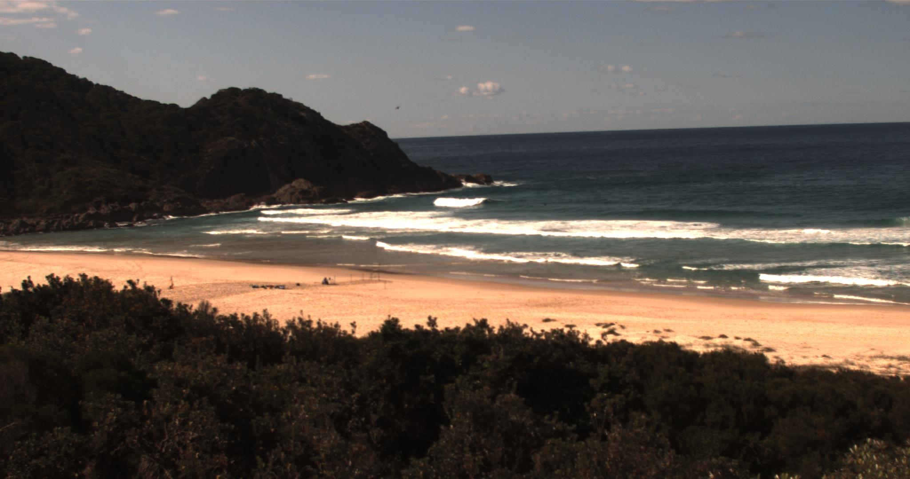
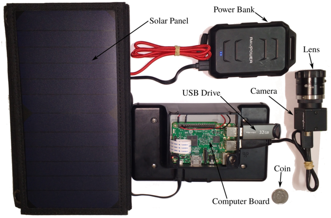

# Introduction

This project aims to provide the information needed to build an ARGUS-like
coastal monitoring system based on single board computers and FLIR
(formally Point Grey) machine vision cameras.

This a continuation and update to the system deployed at the Figure 8 pools
site, which was detailed in [this paper](https://www.mdpi.com/2072-4292/10/1/11)
and was operational for over an year.

The image below was captured at Boomerang Beach (New South Wales) earlier this
year with a very similar similar set-up to the one described in this repository.



# 1 Hardware

## 1.1 Computer Board

This project has been developed using a Raspberry Pi Model 3 B. Better results
may be achieved using the new Raspberry Pi 4 or a NVIDIA Jetson board.

The components of the system are:
1. [Raspberry Pi board](https://www.raspberrypi.org/products/raspberry-pi-4-model-b/)
2. [Raspberry Pi 7in display](https://www.raspberrypi.org/products/raspberry-pi-touch-display/)
3. [Raspberry Pi display case](https://thepihut.com/products/raspberry-pi-7-touchscreen-display-case-white)
4. [16Gb+ SD card](https://www.raspberrypi.org/documentation/installation/sd-cards.md)
5. Keyboard
6. Mouse
7. External storage. In this case a 16Gb USB stick.
8. [Optional] Battery bank
9. [Optional] Solar panel

**Note:** the 7in display case mentioned in the link above is not compatible
with the Raspberry Pi model 4 B. At the time of writing (late October 2019)
there seems not to be such a case for the Pi model 4.

Assembly should be straight forward but if in doubt, follow the tutorials from
the Raspberry Pi Foundation:

[](https://www.raspberrypi.org/help/quick-start-guide/2/)


## 1.2 Machine Vision Camera

Our camera of choice is the [Flea 3 USB3 3.2 MP](https://www.flir.com/products/flea3-usb3/) model. The implementation provided here should also work with
any FLIR machine vision USB3 camera.

For this project, we used a [Tamron 8mm lens](https://www.flir.fr/products/tamron-8mm-11.8inch-c-mount-lens/). Note that you will need a C to CS mount adaptor if your camera has a CS mount and your lens has a C mount.

After assembly, you should have something similar to the system below.




# 2 Software

## 2.1 Operating System (OS)

FLIR recommends Ubuntu for working with their cameras. Unfortunately,
the full version of Ubuntu is too demanding to run on the Raspberry Pi 3.
Therefore, we recommend [Ubuntu Mate](https://www.google.com).

### 2.1.1 Installation

On a separate computer,

1. Download the appropriate Ubuntu Mate image from [here](https://ubuntu-mate.org/raspberry-pi).
2. Use [Fletcher](https://www.balena.io/etcher/) to flash the image to the SD card.

Insert the SD card in the Raspberry Pi and connect to mains power.

If everything worked, you will be greeted by Ubuntu Mate's installer. Simply
follow the installer's instructions and finish the install. If everything goes
correctly, the system will reboot and you will be greeted by the welcome screen.


## 2.2 FLIR's Dependencies

Before installing FLIR's software, there are several package dependencies that
need to be installed.

First update your Ubuntu install:

```bash
sudo apt update
sudo apt dist-upgrade
```
This will take a while to finish. Go grab a coffee or a tea.

Next, install the build-essentials package:

```bash
sudo apt install build-essential
```

Now install the required dependencies:

```bash
sudo apt install libusb-1.0-0 libpcre3-dev
```
Finally, install GIT in order to be able to clone this repository.

```bash
sudo apt install git
```

## 2.3 FLIR Spinnaker Setup

[Spinnaker](https://www.flir.com/products/spinnaker-sdk/) is the software responsible for interfacing the camera and the computer.
Download Spinnaker from [here](https://flir.app.boxcn.net/v/SpinnakerSDK).

Open the folder where you downloaded Spinnaker and decompress the file.

Now, open a terminal in the location of the extracted files and do:
```bash
sudo sh install_spinnaker_arm.sh
```

Follow the instructions in the prompt until the installation is complete.

**Note:** You may fall into a dependency loop here. Pay close attention to
the outputs in the prompt after running the installer. If in trouble, `apt`
can help you:

```bash
sudo apt install -f --fix-missing
```

From FLIR's README file, it is also recommend to increase the size of USB stream
from 2Mb to 1000Mb. To do this, do not follow their instructions as they will
not work for Raspberry Pi Based systems. Instead do:

```bash
sudo nano /boot/cmdline.txt
```

Append to the end of the file:

```
usbcore.usbfs_memory_mb=1000
```
Reboot your Raspberry Pi and check if it worked with:

```
cat /sys/module/usbcore/parameters/usbfs_memory_mb
```

Connect your camera and launch Spinnaker GUI:

```bash
spinview
```

I everything went well, you should see your camera in the USB Interface panel
on the left.


We will not use Spinview in this project but it is a useful tool to debug your camera. Please check Spinnaker documentation regarding Spinview usage.

## 2.4 PySpin

It is recommend to use python 3.7 with PySpin. Unfortunately, python 3.7 does not come preinstalled with Ubuntu Mate. You will need to install it from the source:

Install the dependencies:

```bash
sudo apt install -y build-essential tk-dev libncurses5-dev libncursesw5-dev libreadline6-dev libdb5.3-dev libgdbm-dev libsqlite3-dev libssl-dev libbz2-dev libexpat1-dev liblzma-dev zlib1g-dev libffi-dev
```

Compile. This will take a long time on the Raspberry Pi, go grab another coffee.

```bash
wget https://www.python.org/ftp/python/3.7.5/Python-3.7.5.tar.xz
tar xf Python-3.7.5.tar.xz
cd Python-3.7.0
./configure --prefix=/opt/python --enable-optimizations
make -j 4
make install
```
*TODO: Finish python installation guide.*

Before installing FLIR's python interface, make sure the following dependencies are met:

```bash
python3.7 -m pip install --upgrade --user numpy matplotlib Pillow==5.2.0
```

Download FLIR's python wheel from [https://flir.app.boxcn.net/v/SpinnakerSDK/folder/74731091944](here).

```bash
sudo python3.7 -m pip install spinnaker_python-1.26.0.31-cp37-cp37m-linux_aarch64.whl
```

Finally, install [OpenCV](https://pypi.org/project/opencv-python/).

```bash
sudo python3.7 -m pip install opencv-python opencv-contrib-python
```


# 3 Image Capture Configuration File

The configuration file to drive a capture cycle is in JSON format:

```json
{
    "data": {
        "output": "/media/picoastal/capture/"
    },
    "parameters": {
        "frame_rate": 2,
        "capture_duration": 20,
        "height": 1080,
        "width": 1920,
        "offset_x": 80,
        "offset_y": 236,
        "capture_hours": [5, 6, 7, 8, 9, 10, 11, 12, 13, 14, 15, 16, 17, 18],
        "image_format": "jpeg",
        "stream_size": [800, 600],
        "notify": true
    }
}
```

For an example, see [here](src/capture.json).

Explanation of the parameters above:

- ```output```: The location to where to write the frames.
- ```frame_rate```: The capture frequency rate in Hz (which is equivalent to frames per second).
- ```duration```: Capture cycle duration in minutes.
- ```height```: The height of the frame in pixels.
- ```width```: The width of the frame in pixels.
- ```offset_x```: Offset in the x-direction from the sensor start.
- ```offset_y```: Offset in the y-direction from the sensor start.
- ```capture_hours```: Capture hours. If outside these hours, do not grab any frames.
- ```image_format```: To which format to write the frames.
- ```stream_size```: Size of the window when displaying the video stream in the screen.
- ```notify```: if ```true``` will send an email with latest captured frame. See note below.


## 3.1 Notifications configuration

To be defined.

# 4 Capturing frames

First, make sure you have the appropriate code. Clone this repository with:

```bash
cd ~
git clone https://github.com/caiostringari/PiCoastal.git picoastal
```

## 4.1 Displaying the camera stream.

This is useful to point the camera in the right direction, to set the focus, and
aperture.

To launch the stream do:

```bash
cd ~/picoastal
python src/capture.py -i capture.json > capture.log &
```

It is also useful to create a desktop shortcut to this script so that you don't need to
use the terminal every time.

Open ```pluma``` or ```nano``` text editor and enter the following:

```
[Desktop Entry]
Version=1.0
Type=Application
Terminal=true
Exec=bash python ~/picoastal/src/stream.py -i ~/picoastal/src/capture.json
Name=PiCoastal Stream
Comment=PiCoastal Stream
Icon=~/picoastal/doc/camera.png
```
Save the file in your ```Desktop``` folder.

## 4.2 Single capture cycle

The main capture program is [capture.py](src/capture.py). To run a single capture cycle, do:

```bash
cd ~/picoastal
python src/capture.py -i capture.json > capture.log &
```
## 4.3 Scheduling capture cycles

Coming soon.

# 5 Required improvements

1. Add the ability to handle more than one camera
